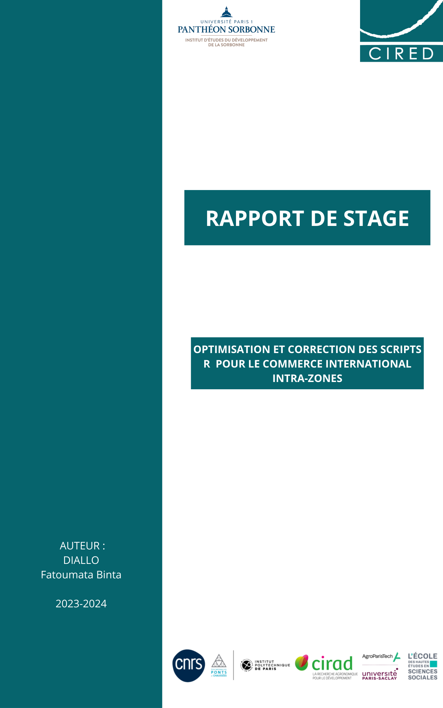

```{r,echo = FALSE}
setwd("/Users/binta/Desktop/Rapport de stage/Dossier GIT")
```

```{r,echo=FALSE, warning=FALSE, message=FALSE}
library(janitor)
library(readxl)
library(dplyr)
library(stringr)
library(tidyverse)
library(writexl)
library(datawizard)
library(kableExtra)
library(gridExtra)
library(ggthemes)
library(RColorBrewer)
library(ggplot2)
```

```{r, echo=FALSE, warning=FALSE,message=FALSE}
baci <- readRDS("BACI_HS22_Y2022_V202401b.rds")
hs_gtap <- read_xlsx("JobID-98_Concordance_H6_to_GP.xlsx")
country_codes <- read_csv("country_codes_V202401b.csv")
Concordance_hs_sitc3 <- read.csv("JobID-69_Concordance_HS_to_S3.CSV")
```

```{r, echo=FALSE}
hs_gtap <- hs_gtap %>% rename(produit = HS.2022.Product.Code)
Concordance_hs_sitc3 <- Concordance_hs_sitc3 %>% rename(produit = HS...Combined..Product.Code)

```

```{r, echo=FALSE}
baci_gtap_full <- full_join(baci, hs_gtap, by = "produit") %>%
  na.omit() %>%
  full_join(country_codes, by = c("exportation" = "country_code")) %>%
  arrange(exportation) 
```
